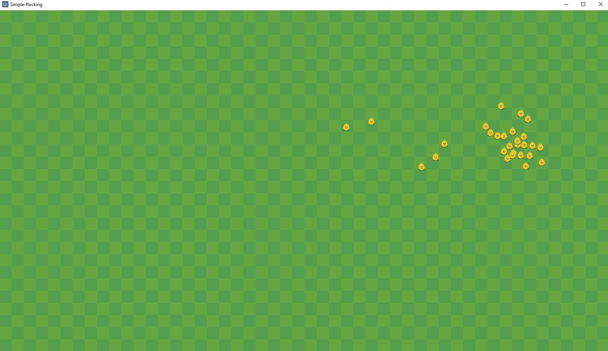

# Boids In Godot

This is a godot implementation of [Craig Reynolds Boids](https://en.wikipedia.org/wiki/Boids). A more detailed breakdown of [Boids with pseudocode can be found here](http://www.kfish.org/boids/pseudocode.html).

# Running the Demo

Click F5 to run the default screen. Then click anywhere on the screen to issue a waypoint for the boids. The boids will continue to chase mouse clicks.

Controls: 
* left click - place target flag
* right click - scatter the boids to random locations on the screen.

[Video demonstration](https://www.youtube.com/watch?v=aCfoX45yF0w)

# Adjusting the simulation

You can control the paremeters of the simulation in the editor without touching code (though feel free to mess with the code as well! ;) )

The Chicken scene script variables:
* View distance - distance to view flock for each Boid
* Avoid distance - the distance at which a void will try to avoid another boid
* Max Speed - the maximum speed of the boid
* Force - There is a seperate force for each vector: cohesion, separation, alignment and mouse follow. Try playing with them :) 

The RandomChickens scene script variables:
* Boids - the number of boids that will spawn

# Credits

This project uses the [FarmPuzzleAnimals](https://comigo.itch.io/farm-puzzle-animals) pack created by [CoMiGo](https://comigo.itch.io/)  
